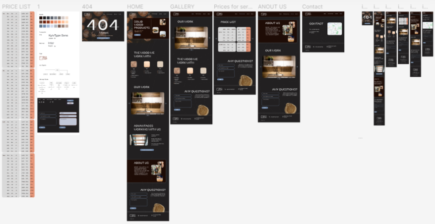

# 🟤Сайт мебельной компании «BIO CWT»

Сайт-многостраничник для мебельной компании, который был разработан для практики работы с макетом.

## 📖О сайте



- 🌳 **Информация**: Информация об услугах, ценах, преимуществах.
- 👫 **О команде**: Знакомство с членами компании.
- 🖼 **Галерея**: Возможность ознакомится с работами.
- 📝 **Есть вопросы?**: Возможность задать вопрос или получить консультацию.
- ⛔️ **404**: Если возникает проблема загрузки.
- 💥 **Адаптивный дизайн**: Сайт полностью адаптивен под любые устройства.
- 📞 **Контактная информация**: Доступ к контактным данным и местоположении.

## 💡 Технологии

-   **HTML5 & CSS3**: Для структурирования и стилизации сайта.
-   **JavaScript**: Для слайдера галерии.

## ⚙️Установка

Чтобы запустить этот проект локально, выполните следующие действия:

1. Клонируйте репозиторий:

    ```bash
    git clone https://github.com/AnyaLap/furniture-company.git
    ```

2. Перейдите в каталог проекта:

    ```bash
    cd furniture-company
    ```

3. Откройте `index.html` в предпочитаемом вами веб-браузере.

---

## 👥 Участники


